# Shopping Microservices

[](https://dev.azure.com/mabt2206/shopping/_build/latest?definitionId=3&branchName=main)
[](https://dev.azure.com/mabt2206/shopping/_build/latest?definitionId=4&branchName=main)


A simple microservices-based shopping application built with .NET 9, demonstrating containerization and Kubernetes deployment patterns.

## 🏗️ Architecture

### Application Architecture
- **Shopping.API**: RESTful API service for product management using MongoDB
- **Shopping.Client**: MVC web application for product display
- **MongoDB**: NoSQL database for product storage

### Infrastructure Architecture

```mermaid
graph TB
    User[👤 User] --> LB[⚖️ Load Balancer]
    
    subgraph "Azure Kubernetes Service (AKS)"
        LB --> ClientSvc[🌐 Shopping Client Service<br/>Port 80]
        LB --> APISvc[🔗 Shopping API Service<br/>Port 80]
        
        subgraph "Worker Nodes"
            subgraph "Node 1"
                ClientSvc --> ClientPod[📱 Shopping Client Pod<br/>ASP.NET Core MVC]
                APISvc --> APIPod[🔧 Shopping API Pod<br/>ASP.NET Core Web API]
            end
            
            subgraph "Node 2"
                APISvc --> APIPod2[🔧 Shopping API Pod<br/>Replica]
                DBSvc[🗄️ MongoDB Service<br/>Port 27017] --> DBPod[📊 MongoDB Pod<br/>Database Storage]
            end
        end
    end
    
    subgraph "External Services"
        ACR[📦 Azure Container Registry<br/>Container Images]
        DevOps[🚀 Azure DevOps<br/>CI/CD Pipelines]
    end
    
    APIPod --> DBSvc
    APIPod2 --> DBSvc
    ClientPod -.->|HTTP Calls| APISvc
    
    DevOps -.->|Deploy| ClientPod
    DevOps -.->|Deploy| APIPod
    ACR -.->|Pull Images| ClientPod
    ACR -.->|Pull Images| APIPod
    
    classDef userClass fill:#e1f5fe
    classDef serviceClass fill:#f3e5f5
    classDef podClass fill:#e8f5e8
    classDef dbClass fill:#fff3e0
    classDef externalClass fill:#fce4ec
    
    class User userClass
    class ClientSvc,APISvc,DBSvc serviceClass
    class ClientPod,APIPod,APIPod2,DBPod podClass
    class ACR,DevOps externalClass
```



## 🚀 Quick Start

### Local Development (Docker)

```bash
# Clone the repository
git clone https://github.com/miguelbtcode/shopping-microservices-k8s.git
cd shopping-microservices-k8s

# Run with Docker Compose
docker-compose up -d
```

**Access the application:**
- Web App: http://localhost:8001
- API Swagger: http://localhost:8000/swagger

### Kubernetes Deployment

```bash
# Deploy to local Kubernetes
kubectl apply -f k8s/

# Deploy to Azure Kubernetes Service (AKS)
kubectl apply -f aks/
```

## 🛠️ Technologies

- **.NET 9** - Latest .NET framework
- **ASP.NET Core** - Web framework
- **MongoDB** - NoSQL database
- **Docker** - Containerization
- **Kubernetes** - Container orchestration
- **Azure DevOps** - CI/CD pipelines
- **Azure Container Registry** - Container registry

## 📦 Project Structure

```
Shopping/
├── Shopping.API/          # Product API service
├── Shopping.Client/       # MVC web application
├── docker-compose.yaml    # Local development setup
aks/                       # Azure Kubernetes manifests
k8s/                       # Local Kubernetes manifests
pipelines/                 # Azure DevOps pipelines
```

## 🔧 Configuration

The application uses environment-specific configurations:

- **Development**: Uses local MongoDB connection
- **Production**: Configured for Azure/cloud deployment

## 📝 API Endpoints

- `GET /product` - Retrieve all products

## 🤝 Contributing

1. Fork the repository
2. Create a feature branch
3. Commit your changes
4. Push to the branch
5. Create a Pull Request

## 📄 License

This project is licensed under the MIT License - see the [LICENSE](LICENSE) file for details.

---

**Author**: Miguel Barreto  
**Year**: 2025
